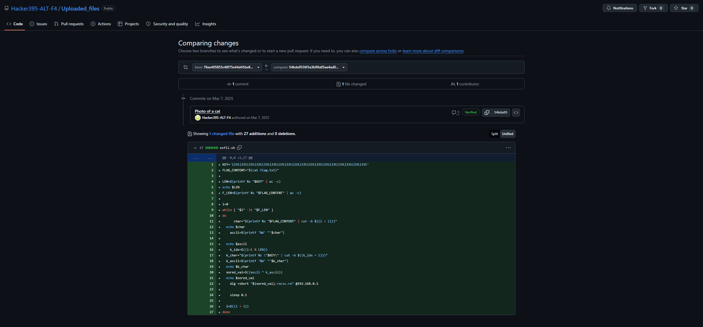

# phantom-logger

### Category: Network, OSINT, Threat Hunting | Difficulty: Medium | Tenant: Cyberedu

Description: Un serviciu obișnuit de jurnalizare web funcționează în fundal, colectând șirurile de User-Agent din cererile primite.

Totuși, în spatele aparențelor, ceva nu este în regulă – există suspiciuni privind o portiță de acces ascunsă.

Looking at the http streams in the PCAP, we can see base64 after some Mozilla User-Agents, that lead to a script on github. The script is no longer, but by searching for changes in the repository, we can find it:



To reverse the script, we must gather all subdomains of .rocsc.ro (use dns filter and then write the numbers) and XOR their ASCII unicodes.
```python
key = "l33tl33tl33tl33tl33tl33tl33tl33tl33tl33tl33tl33tl33tl33tl33tl33tl33tl33t"
vals = [47,103,117,15,14,2,10,66,85,4,82,18,89,82,5,21,84,7,11,68,95,4,82,65,91,2,82,22,95,86,81,65,8,87,4,22,92,85,87,70,13,81,10,69,88,80,6,77,84,87,85,23,14,2,2,65,94,82,6,21,9,6,87,66,88,10,11,70,17]

flag = ""
for i, v in enumerate(vals):
    k = key[i % len(key)]
    flag += chr(v ^ ord(k))

print(flag)
```
Flag: CTF{b19697af5a6a848037a571ab3eb5dd7b0fd2ab914c598dfcb1152a5ae5d64982}
